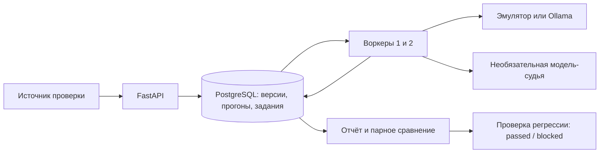

# GaugeLab

Платформа оценки LLM и промптов: сохраняет версии контрольных наборов, запускает
фоновые проверки, сравнивает результаты и блокирует релиз при регрессии.
Для каждого ответа доступны исходный вопрос, промпт, seed, метрики и данные об использовании модели.

**Стек:** Python 3.12+, FastAPI, PostgreSQL 17, SQLAlchemy, Alembic, HTTPX, Docker Compose.
Два воркера выполняют задания независимо; внешний брокер для этого объёма не требуется.

В комплект входит **предсказуемый эмулятор**, который позволяет проверить всю
платформу без загрузки моделей и платных запросов. Адаптер Ollama реализован отдельно.
Локальные результаты относятся к эмулятору; запуск с настоящей моделью Ollama не выполнялся.

## Запуск

Нужны Docker с Compose и Python 3; для проверки кода и сценария восстановления — `uv`.

```bash
make up          # Создаёт .env, применяет миграции, запускает API и воркеры.
make smoke       # Сравнивает промпты и проверяет оценку модели-судьи.
make check       # Проверяет зависимости, стиль и форматирование.
make test        # Запускает тесты с отдельной PostgreSQL.
make recovery    # Проверяет восстановление после остановки воркеров и модели.
make down        # Останавливает сервисы, сохраняя данные.
```

Swagger: <http://localhost:8260/docs>. Порт доступен только с локального компьютера.
База данных и эмулятор не публикуют порты. Токен администратора находится в `.env`;
файл исключён из Git. `make init` не перезаписывает существующий токен.

Сценарий `make recovery` запускается после `make up` и `make check`. Он временно
останавливает сервисы **этого проекта**, затем восстанавливает их. Не запускайте
его параллельно с ручным демо.

## Возможности

- Неизменяемые версии датасетов, промптов и конфигураций моделей с SHA-256 содержимого.
- Полный снимок входных данных каждого прогона и идемпотентное создание по `request_id`.
- От одного до пяти повторов каждого вопроса с сохранением значений seed.
- Точное совпадение, токенный F1 и полнота обнаружения ключевых фраз.
- Необязательная модель-судья с версионированными правилами оценки.
- Разброс результатов между повторами, p95 задержки и расчёт по заданным тарифам.
- Парное сравнение по вопросам: победы, ничьи, проигрыши и bootstrap-интервал изменения метрики.
- Сохранённое решение о регрессии с результатом каждой проверки.
- CLI для CI: код `0` разрешает продолжить, код `2` блокирует релиз.
- Конкурентные воркеры, повторное выполнение заданий и защита от результатов устаревшего исполнителя.

## Архитектура



При создании прогона все задания сохраняются в одной транзакции. Воркеры выбирают
их через `FOR UPDATE SKIP LOCKED` и получают временную аренду. Сетевые вызовы
выполняются вне транзакции БД. Результат сохраняется только с действующим токеном
аренды. После сбоя незавершённое задание можно выполнить снова, но в отчёте
остаётся одна строка на сочетание «прогон, вопрос, повтор».

Статус прогона рассчитывается по заданиям, поэтому завершение двух воркеров
одновременно не может потерять обновление общего счётчика. Смена версии кода
оценки относительно снимка прогона приводит к ошибке, а не к незаметной подмене метрик.

## Версии и воспроизводимость

Версия артефакта задаётся сочетанием типа, имени и версии. Повторная запись того же
содержимого возвращает существующий артефакт; другое содержимое даёт `409`.
Редактирования и удаления версий через API нет.

Прогон сохраняет датасет, шаблон промпта, конфигурацию модели, тарифы, параметры
генерации, версию оценивания и при необходимости конфигурацию судьи. Эталонный ответ
**не передаётся оцениваемой модели**. Он используется в локальных метриках и доступен
судье. Подстановка `{question}` — обычная замена текста, без исполнения шаблонного кода.

Повтор с новым `request_id` позволяет воспроизвести входные условия. Это не обещание
одинаковых ответов реальной LLM: даже при фиксированном seed результаты могут зависеть
от серверной реализации, оборудования и настроек. Для проверки устойчивости доступны
повторы и среднее стандартное отклонение метрики внутри одного вопроса.
При единственном повторе разброс не оценивается и возвращается `null`.

Значения `validation` и `test` обозначают назначение набора. Сервис не может проверить,
использовались ли тестовые вопросы при ручной настройке промпта: независимый набор
нужно сохранять организационно.

## Метрики

| Метрика | Смысл |
|---|---|
| `exact_match` | Совпадение после нормализации Unicode, регистра и выделения слов |
| `token_f1` | F1 по мультимножествам токенов; повторяющиеся слова учитываются |
| `keyword_recall` | Доля ключевых фраз, найденных по целым токенам |
| `judge_score` | Оценка от 0 до 1 от выбранной модели-судьи |
| `mean_repeat_stddev` | Среднее по вопросам стандартное отклонение между повторами |
| `p95_seconds` | 95-й перцентиль времени успешной попытки, включая вызов судьи |
| `cost_lower_bound` | Расчётная стоимость известных успешных вызовов |
| `cost_complete` | Достаточно ли данных, чтобы применять ограничение стоимости |

Нормализованное совпадение игнорирует пунктуацию. Токенный F1 и ключевые фразы —
лексические показатели, **не универсальная оценка смысла, полезности или безопасности**.
Каждый датасет должен иметь подходящие эталоны и ключевые фразы. Ошибки исполнения
не исключаются из знаменателя метрик: они дают нулевую оценку и отдельно блокируют релиз.
Промежуточный отчёт также содержит нули для незавершённых заданий и не подходит для релизного решения.

Стоимость рассчитывается по тарифам конфигурации модели за миллион входных и
выходных токенов. Оба тарифа и порог стоимости должны быть в одной валюте.
Это оценка, а не счёт провайдера. Для эмулятора токены условные, а тариф по умолчанию
нулевой; стоимость оборудования не учитывается.

Если воркер потерял ответ, предыдущий вызов мог потребить ресурсы. После повторной
попытки, ошибки или отсутствия корректных данных об использовании `cost_complete`
становится `false`. Известная часть стоимости остаётся в отчёте, но проверка бюджета
не пропускает такой результат. Время ожидания очереди и неудачных попыток не входит в p95.

## Модель-судья

При наличии `judge_model_id` судья получает вопрос, эталон и ответ, а возвращает JSON
с полями `score` и `reason`. Схема строго проверяется; некорректный ответ вызывает
повтор, затем ошибку задания. Сохраняются исходный ответ судьи, его конфигурация,
версия правил `judge-v1` и разобранная оценка. В эмуляторе судья лишь сравнивает ответ
с эталоном; это проверка работы конвейера, а не настоящая семантическая оценка.

Судья тоже может ошибаться, менять оценку и поддаваться инструкциям внутри ответа.
Строгая JSON-схема не устраняет эти риски. Для важных решений нужны независимые
примеры и проверка человеком. Парное сравнение в GaugeLab сопоставляет числовые
оценки одинаковых вопросов; отдельного слепого A/B-опроса судьи здесь нет.

## Проверка регрессии

`POST /v1/gates` сохраняет решение `passed` либо `blocked`. По умолчанию проверяется:

1. Прогоны разные, оба завершены и не содержат ошибок.
2. Совпадают датасет, версия оценки, число повторов и начальный seed.
3. Для сравнения оценки судьи совпадает также его версия.
4. В наборе не менее пяти разных вопросов.
5. Средняя метрика кандидата не ниже 0,8.
6. Нижняя граница bootstrap-интервала изменения не ниже −0,05.

Опционально задаются максимальный p95 и бюджет. В сохранённом решении видны пороги,
измеренные значения, причины блокировки и контрольные суммы параметров прогонов.

Для парного сравнения сначала усредняются повторы одного вопроса. Затем выполняются
1000 bootstrap-перевыборок **вопросов** с фиксированным seed. Десять повторов одного
вопроса не превращаются в десять независимых вопросов. Отчёт содержит изменение
средней метрики, интервал 95% и число побед, ничьих и проигрышей.

Этот интервал описывает наблюдаемый набор; он не доказывает качество на произвольных
данных. Многократный подбор промптов по одному набору, зависимые вопросы и множественные
сравнения требуют отдельного контроля. Порог в пять вопросов — технический минимум
демонстрации, а не рекомендация для надёжного статистического вывода.

Интеграция с CI:

```bash
# ADMIN_TOKEN должен быть передан через окружение, например через секреты CI.
uv run python scripts/gate.py BASELINE_UUID CANDIDATE_UUID --max-drop 0.05
```

Код `0` означает успешную проверку, `2` — блокировку, `1` — техническую ошибку.
Сервис сам не выкладывает приложение и не меняет настройки репозитория. Реальный
релиз блокируется, когда вызывающий CI учитывает код завершения этого шага.

## API

Рабочие методы требуют `Authorization: Bearer <ADMIN_TOKEN>`. Проверки `/health/*` открыты.

| Метод / путь | Назначение |
|---|---|
| `POST /v1/datasets` | Создать версию набора вопросов |
| `POST /v1/prompts` | Создать версию промпта |
| `POST /v1/models` | Создать конфигурацию модели и тарифов |
| `GET /v1/artifacts/{id}` | Получить содержимое и контрольную сумму версии |
| `POST /v1/runs` | Создать прогон; повтор того же запроса идемпотентен |
| `GET /v1/runs/{id}` | Получить снимок параметров, ответы и сводные метрики |
| `POST /v1/gates` | Сравнить два прогона и сохранить решение |
| `GET /v1/gates/{id}` | Получить сохранённое решение |
| `GET /metrics` | Получить число заданий по состояниям |

Пример датасета:

```json
{
  "name": "geography",
  "version": "1",
  "split": "validation",
  "cases": [
    {"id": "france", "question": "Столица Франции?", "expected": "Париж", "required_terms": ["Париж"]}
  ]
}
```

Такого набора достаточно для запуска, но недостаточно для стандартной проверки
регрессии. Пример шаблона: `{"name":"short","version":"1","template":"Ответь кратко: {question}"}`.
Модель для локального демо: `{"name":"demo","version":"1","backend":"demo"}`.

При создании прогона указываются `request_id`, `dataset_id`, `prompt_id`, `model_id`,
необязательный `judge_model_id`, `repeats`, `seed`, `temperature` и `max_output_tokens`.
Ограничения: до 200 вопросов, до 5 повторов, до 4096 выходных токенов на вызов.

## Подключение Ollama

Задайте `OLLAMA_URL`, доступный из контейнеров. По умолчанию используется
`http://host.docker.internal:11434`. Модель должна быть установлена на этом сервере
заранее. GaugeLab не загружает модели автоматически и не выбирает их вместо оператора.

Получите полное имя с тегом и `digest` через `/api/tags`. В `POST /v1/models` задайте
`backend: "ollama"`, `model_name` и полный SHA-256 в `artifact_digest`.
Вызов выполняется через `/api/generate` с `stream: false`, seed, температурой и
лимитом выходных токенов. Digest проверяется до и после генерации; обычная подмена
тега приводит к ошибке. Это не атомарная блокировка серверной модели: оператор
должен сохранять артефакт неизменным на протяжении прогона.

Адреса провайдеров задаются только окружением сервиса, а не входящим запросом.
Перенаправления HTTP отключены. Таймаут по умолчанию — 10 секунд на вызов; для
реальной локальной модели его может потребоваться увеличить вместе со сроком аренды.

## Проверки и границы проекта

[VERIFICATION.md](VERIFICATION.md) содержит результаты локальных проверок.
[GitHub Actions](https://github.com/dasferwer/gaugelab/actions) проверяет код, тесты, запуск и восстановление.
В тестах используется настоящая база PostgreSQL. Проверки Ollama выполняются с
управляемыми HTTP-ответами; smoke и recovery используют отдельный HTTP-эмулятор.

В проект не входят публичное развёртывание, многопользовательская авторизация,
внешний биллинг, автоматическая очистка данных и загрузка реальных моделей.
Один административный токен даёт полный доступ к вопросам и ответам. Для публичного
сервиса нужны отдельные права, ограничения запросов и правила хранения данных.

Генерация после сбоя может повториться и потребить ресурсы ещё раз. Дедупликация
создания прогона и результатов в БД **не означает однократного вызова внешней модели**.

Протокол Ollama: [официальное описание API](https://github.com/ollama/ollama/blob/main/docs/api.md).

## Безопасность тестового окружения

Полный набор запускается через `make test`: профиль Compose задаёт `TESTING=1`,
адрес `test-db:5432` и отдельную базу `gauge_test`. У тестовой PostgreSQL
нет тома прикладной базы: данные находятся в tmpfs.

Проверка выполняется до импорта прикладных модулей, миграций и очистки таблиц.
Обычный `pytest` с прикладными адресами или без явного `TESTING=1` завершается
ошибкой конфигурации. Подмена хоста через query-параметр URL также запрещена.
Сообщение об отказе называет переменную, но не выводит URL с паролем.
Защита предотвращает ошибочный выбор окружения; фактическую изоляцию обеспечивает
отдельный профиль Compose.

Саму защиту можно проверить без БД и сети:

```bash
make test-safety
```

Эта команда выполняет только `tests/test_fixture_safety.py` без внешних fixtures.
Дочерние процессы проверяют настоящий запуск pytest с небезопасным окружением,
а попытки сети и запуска миграций перехватываются. Полный набор по-прежнему
проверяется через `make test`.
